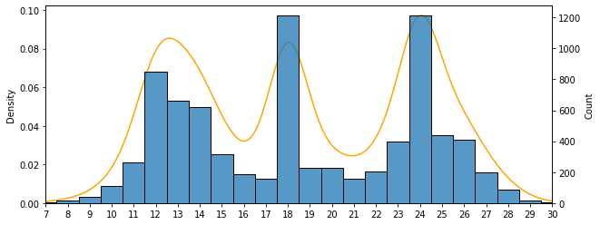

# Volleyball_game_poll
## What is this project about?
There were 24 people inculding me who wanted play volleyball. As you may know, volleyball is played in teams of 6. So, there was an argue over the number of teams:
1. 3 teams of 8 (2 substitue players)
2. 4 teams of 6 (No substitutuions)

At first mose people were thinking that the first option (3 teams) would be more efficient and they suggested to do the substitutions each 6 points. However, I was of the opinion that I may not be fair for all players, so I decided to do some simulations and visualizations.

As the image above shows, there are three different peaks for number of points a player plays in a single game. This starting position of a position affects the total points played by a player. As a result **it would not be fair to play in such manner and it would we better to play in 4 teams of 6.**
